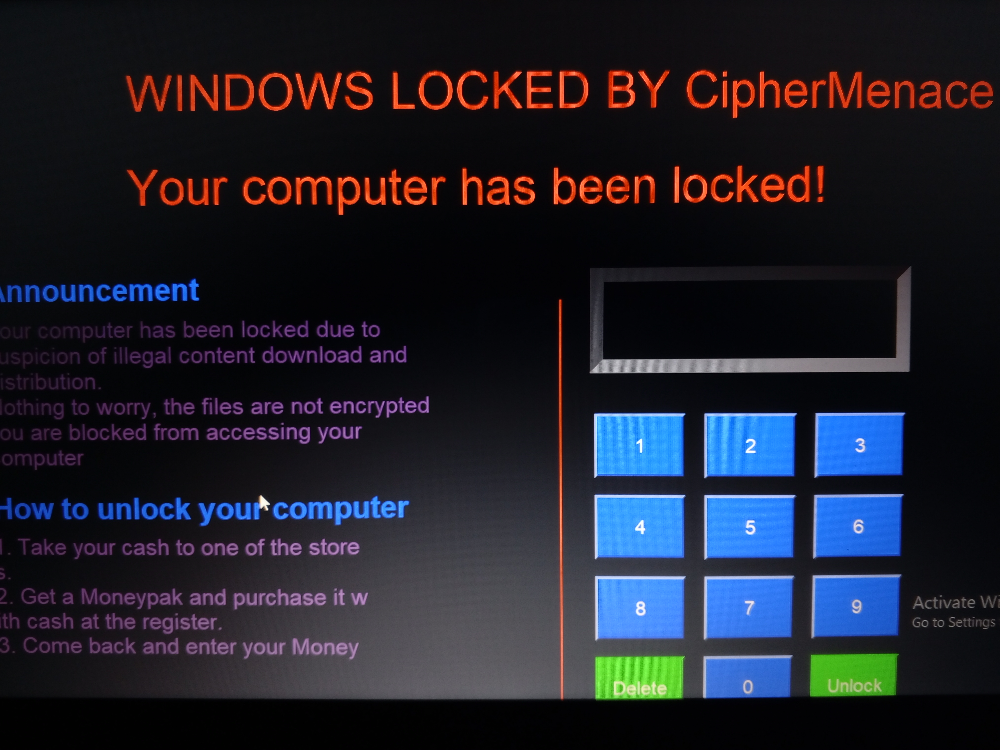

CipherMenace: Secure Computer Lockdown Interface

 


📜 Project Overview
CipherMenace is a security application that locks down your computer interface, simulating a secure environment for testing and demonstration purposes. With its interactive GUI, CipherMenace provides a visually engaging method to simulate real-world scenarios involving system lockdowns and password protection mechanisms.

✨ Features
Full-Screen Lockdown: Completely locks the user's computer until the correct password is provided.
Customizable Password: The default password is predefined, but you can modify it for your testing needs.
Limited Attempts: Users have a set number of tries (default: 5) to unlock the interface before a simulated BSOD (Blue Screen of Death).
Interactive Keypad: Includes a graphical keypad for password entry.
Custom Lock Message: Displays a bold and customizable lock message.


🛠️ Installation
Clone the Repository:
bash
````git clone https://github.com/Illusivehacks/Cipher-menace.git````

Navigate to the Project Directory:
bash
````cd cipher-menace````

Install Dependencies:
bash
````pip install -r requirements.txt````


🚀 Usage
Run the script:
bash
````python cipher_menace.py````

Interact with the GUI to enter the password.

Test features like limited attempts, custom messages, and system behavior.

 

GUI Layout

 

Output Results

⚠️ Disclaimer
CipherMenace is designed for educational and testing purposes only. It does not encrypt files or harm your system but may simulate a restricted environment. Use responsibly and ensure proper consent when testing on any device.

📌 Key Highlights in the Code
Lock Message Customization: Modify the lock_text variable to change the on-screen message.
Password Management: Update the password variable to set your preferred unlock key.
Startup Integration: Automatically registers itself for execution at startup using the startup function.
Simulated BSOD: Utilizes the bsod module for system behavior simulation after repeated failed attempts.
🤝 Contributing
Contributions are welcome! If you'd like to contribute:

1. Fork the repository.
2. Create a feature branch.
3. Commit your changes.
4. Submit a pull request.

📧 Contact
For queries or support, reach out at williamkitungo@gmail.com.

